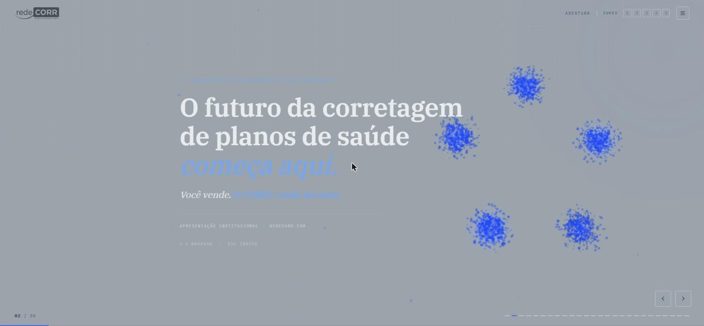
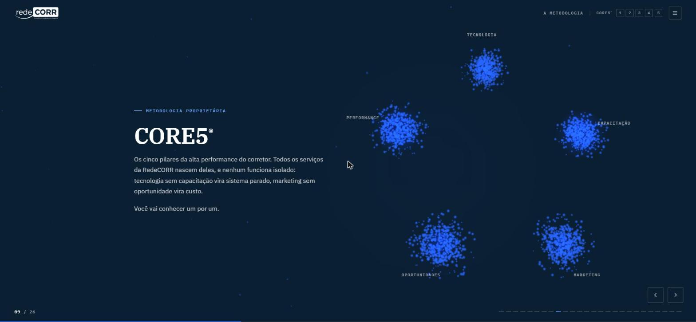

<div align="center">



# RedeCORR · CORE5®

**Apresentação institucional em WebGL — 26 slides, uma única nuvem de 2.800 partículas**

<a href="https://threejs.org"></a>
<a href="https://get.webgl.org"></a>
<a href="#"></a>
<a href="https://cauelimsia.github.io/redecorr-apresentacao/"></a>

**[▶ Abrir a apresentação](https://cauelimsia.github.io/redecorr-apresentacao/)** · [O organismo CORE5®](#-o-organismo-core5) · [Modo apresentador](#-modo-apresentador) · [Rodar local](#-rodar-local)

`Sem framework` · `Sem bundler` · `Sem npm install`

</div>

---

## 🎯 O que é

Apresentação institucional da RedeCORR, ecossistema de crescimento para corretores de
planos de saúde, e da metodologia proprietária CORE5®.

O problema de um deck comercial é que ele precisa impressionar **e** ser editável por quem
não escreve código. A solução aqui separa as duas coisas: a narrativa vive em HTML legível,
e o espetáculo visual vive numa única cena WebGL que reage a ela.

## ✨ O organismo CORE5®

Uma **única** nuvem de 2.800 partículas atravessa o deck inteiro. Ela não é recriada por
slide — ela **muda de formação**, e cada formação carrega um significado da narrativa:

| Formação | O que comunica | Onde aparece |
|---|---|---|
| `pentagon` | estrutura, método | capa e metodologia CORE5®, travada em formação |
| `chaos` | o corretor sem processo | o slide do corretor que trabalha sozinho |
| `grid` | dado, mercado | o chão de dados do slide de mercado |
| `constellation` | rede, ecossistema | o ecossistema, aberto |
| `burst` | convite, expansão | o fechamento |

<div align="center">

</div>

Nos slides de pilar, o nó correspondente **acende** e a formação gira para apresentá-lo.
Os rótulos são HTML posicionado a cada quadro sobre os nós 3D — então continuam nítidos em
qualquer resolução, em vez de virarem textura borrada dentro do canvas.

A capa já abre no pentágono: o CORE5® é o assunto da apresentação, então é a primeira coisa
que a sala vê — ainda sem os nomes dos pilares, porque nomear é a virada do capítulo.

## 🎤 Modo apresentador

Tecla `P`. Abre um painel na base com cronômetro, capítulo, slide atual, **o slide seguinte**
e o roteiro de fala. O deck encolhe para caber acima do painel, então funciona **numa tela só** —
e o roteiro nunca aparece se você projetar apenas o deck em tela cheia.

O roteiro de cada slide vive no próprio HTML e é editável sem tocar em código:

```html
<section class="slide" data-notes="Aqui é escuta, não fala. Pergunte: ...">
```

## ⌨️ Navegação

| Tecla | Ação |
|---|---|
| `←` `→` `Espaço` `PgUp` `PgDn` | trocar de slide |
| `Esc` | abre e fecha o índice |
| `P` | modo apresentador |
| `Home` / `End` | primeiro e último slide |

Também responde a swipe no celular, scroll do mouse e botões na tela.
Cada slide tem URL própria — `#9` abre direto o CORE5®.

## 🚀 Rodar local

```bash
python3 -m http.server 4173
```

Depois abra `http://localhost:4173`. Sem build: é HTML, CSS e JavaScript puro,
publicado direto no GitHub Pages.

## 🧱 Stack

`JavaScript (ES modules)` · `three.js / WebGL` · `HTML5` · `CSS3` · `GitHub Pages`

Zero dependência em runtime além do three.js.
